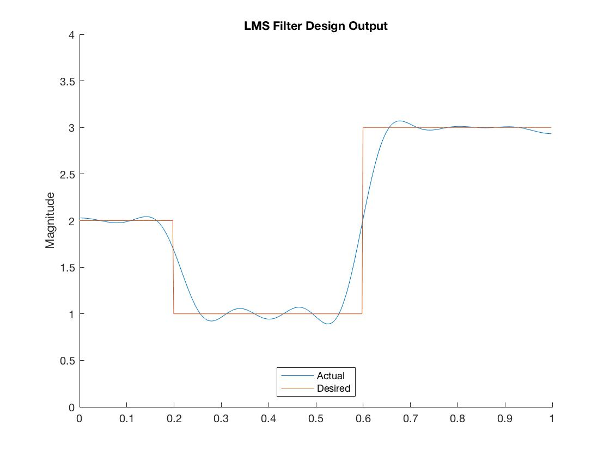
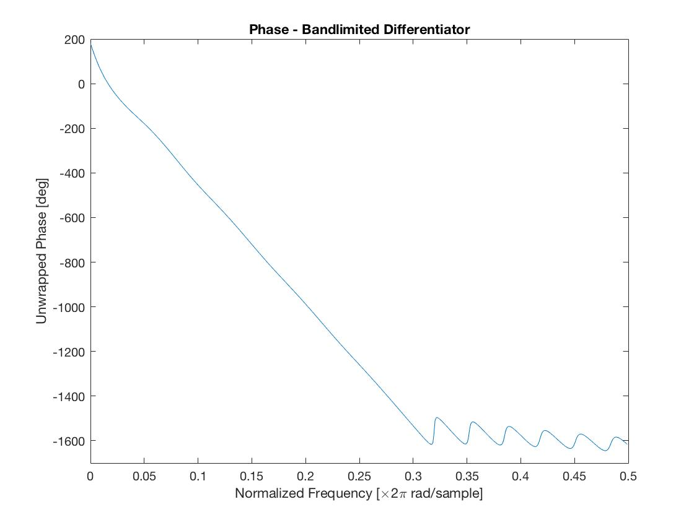

## Adaptive filtering for filter design
(Code can be made available upon request)
Here we use a least-means-square adaptive update to *design* filters which are not of the low-pass, high-pass, band-pass, or band-stop form. We form an input signal as a sum of sinusoids covering a wide range of frequencies, and construct a desired response by attaching weights to each of the sinusoids in our input. We pass the input through our adaptive filter and use a traditional gradient descent against a square loss.

We then use our scheme to design two nontrivial filters, the first being a combination of step functions in the frequency domain, and the second being a bandlimited differentiator which simply sends a signal $ x(t) $ to $ \frac{dx}{dt} $, provided $ x $ has a spectrum in the frequency band of the differentiator.

Adaptive filtering for designing a non-traditional filter.

Bandlimited differentiator magnitude response.

Bandlimited differentiator phase response. (Note the near constant group delay in the passband.)

