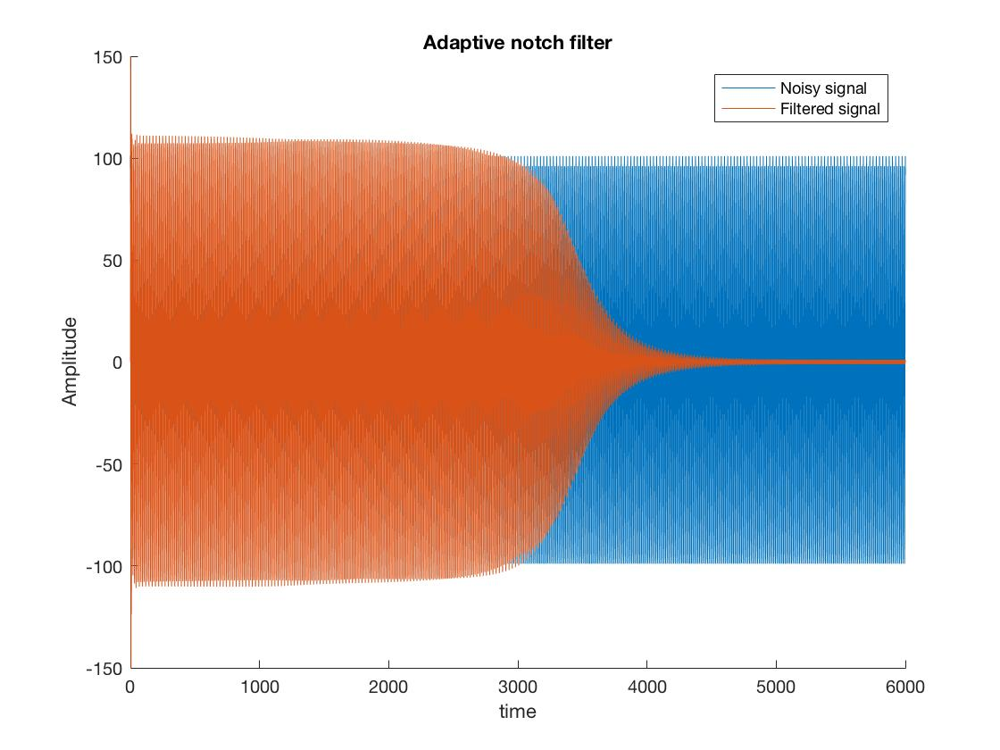
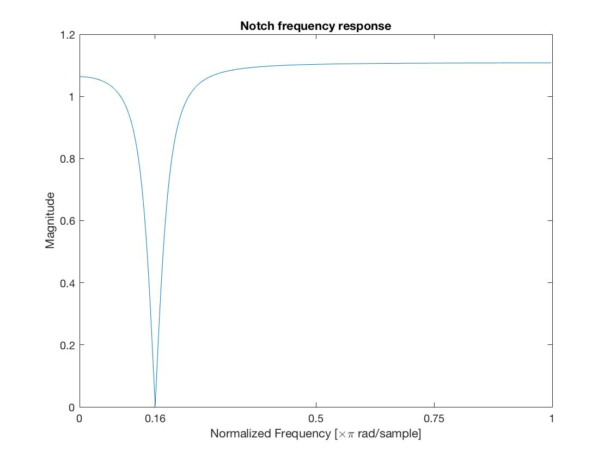
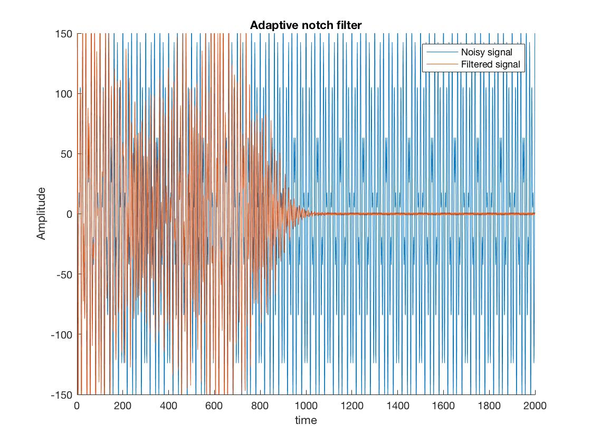
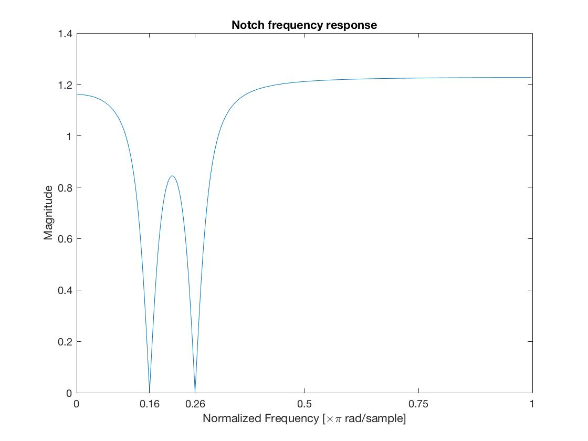
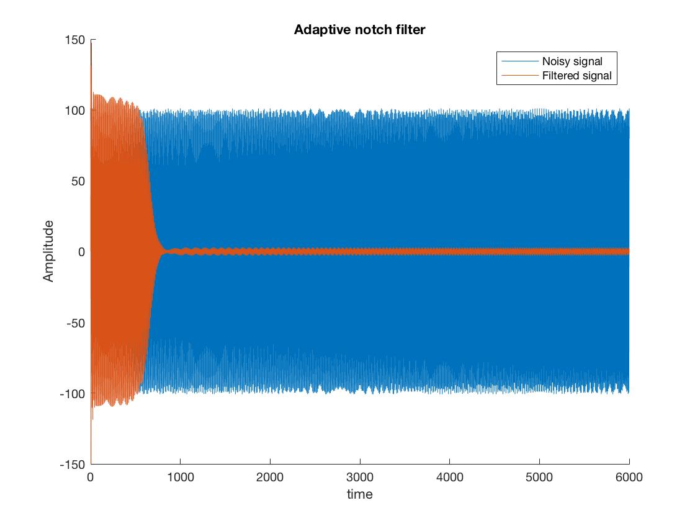
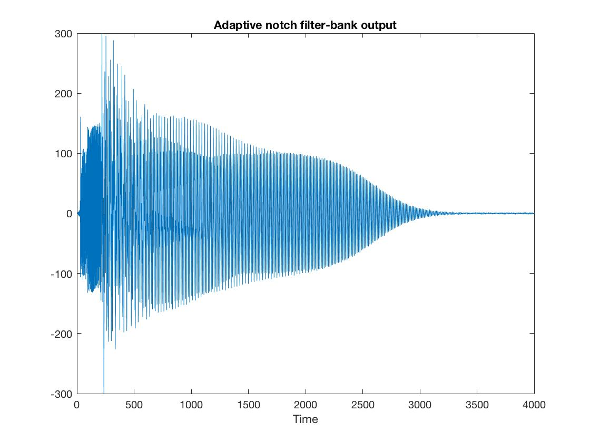
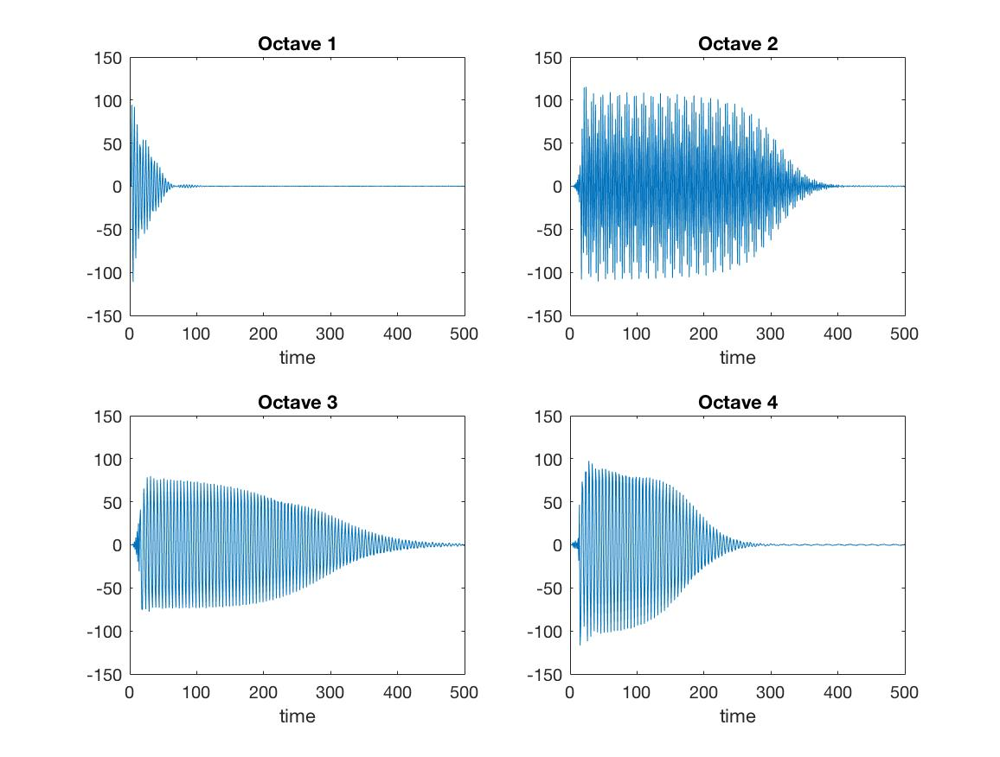

### Adaptive notch filter for sinusoidal noise removal
(Code can be made available upon request)

Here we use a form of unsupervised learning to implement an adaptive notch filter to remove large-amplitude sinusoidal interference at an unknown frequency. We then extend our design to handle cases in which the desired signal is contaminated by *multiple* sinusoids at different frequencies. Next we test our adaptive filter in a dynamic setting, in which the frequency of the contaminating sinusoid changes (slowly and linearly) with time. Finally, we use our adaptive filter as a sub-band processing unit in a four channel filter bank to remove sinusoidal interference present in each of the four octaves.

Adaptive notch for filtering high-amplitude sinusoidal noise of unknown frequency.

Adaptive notch magnitude response after convergence:

Adaptive notch applied to signal contaminated with two sinusoids at different unknown frequencies.

Adaptive notch magnitude response after convergence:

Adaptive notch applied to noise with an unknown and dynamically changing profile.

Adaptive notch applied as a sub-band processing unit in a four-channel perfect reconstruction filter bank (see my filter bank project).

Parallel convergence of four adaptive notch filters in different octaves.

