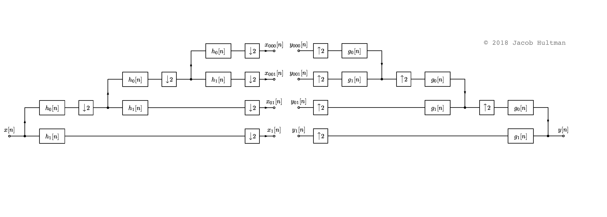
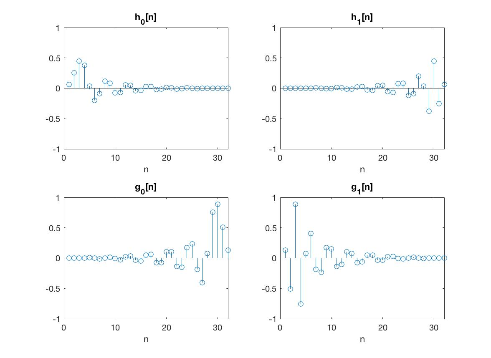
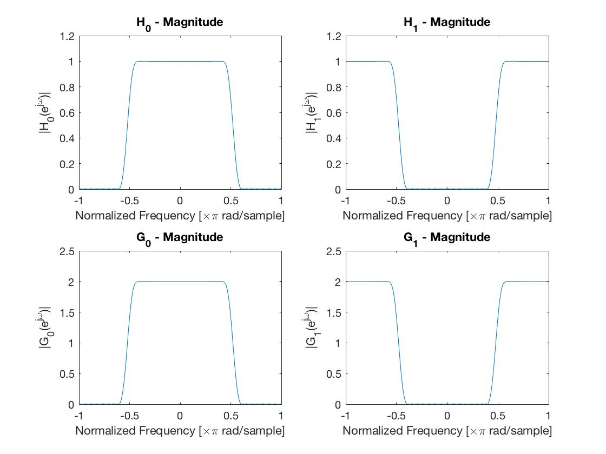
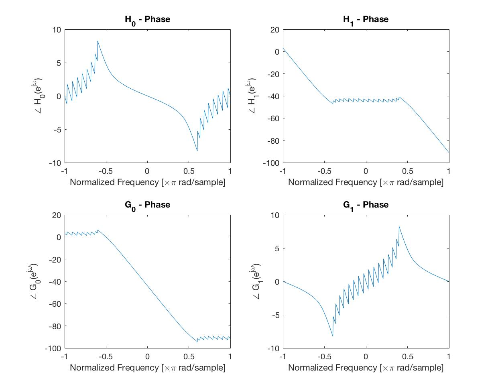
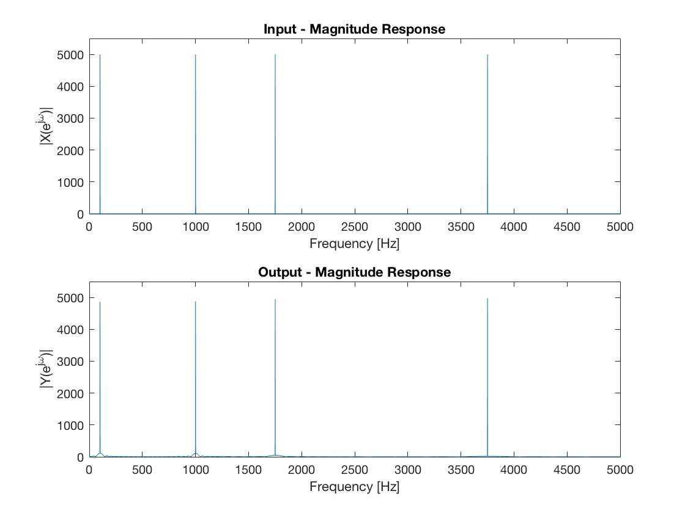
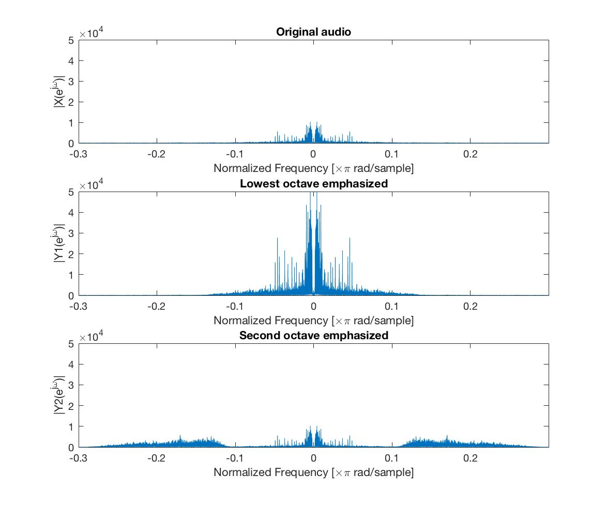

### Four-channel Perfect Reconstruction Filter Bank
(Code can be made available upon request)

Here we implement a four channel filter bank in MATLAB and use it to perform band-specific processing on audio. We use an octave band scheme, decomposing the input into two low frequency bands (1/8th of signal bandwidth), one medium band (1/4th of signal bandwidth), and a high band (upper half of signal bandwidth). For filter design we use MATLAB's firpr2chfb(n, fp), with filter order $ n = 31 $ and passband-edge $ f_p = 0.40 $.

We then test our design by using the filter bank as an *equalizer*. That is, we apply different gains to the four bands of an incoming audio file, emphasizing certain octaves relative to others.

A diagram of our design:

$ h_0, h_1, g_0, \text{and } g_1 $ are chosen to be quadrature mirror filters. 

The filters are complementary low-pass and high-pass.

Note that the filters have roughly linear phase in the pass bands, which will give us constant group delay (important).

Here we send in a sum of sinusoids centered at the different bands and verify (near) perfect reconstruction.

Here we use the filter bank for equalization, emphasizing certain octaves over others.

